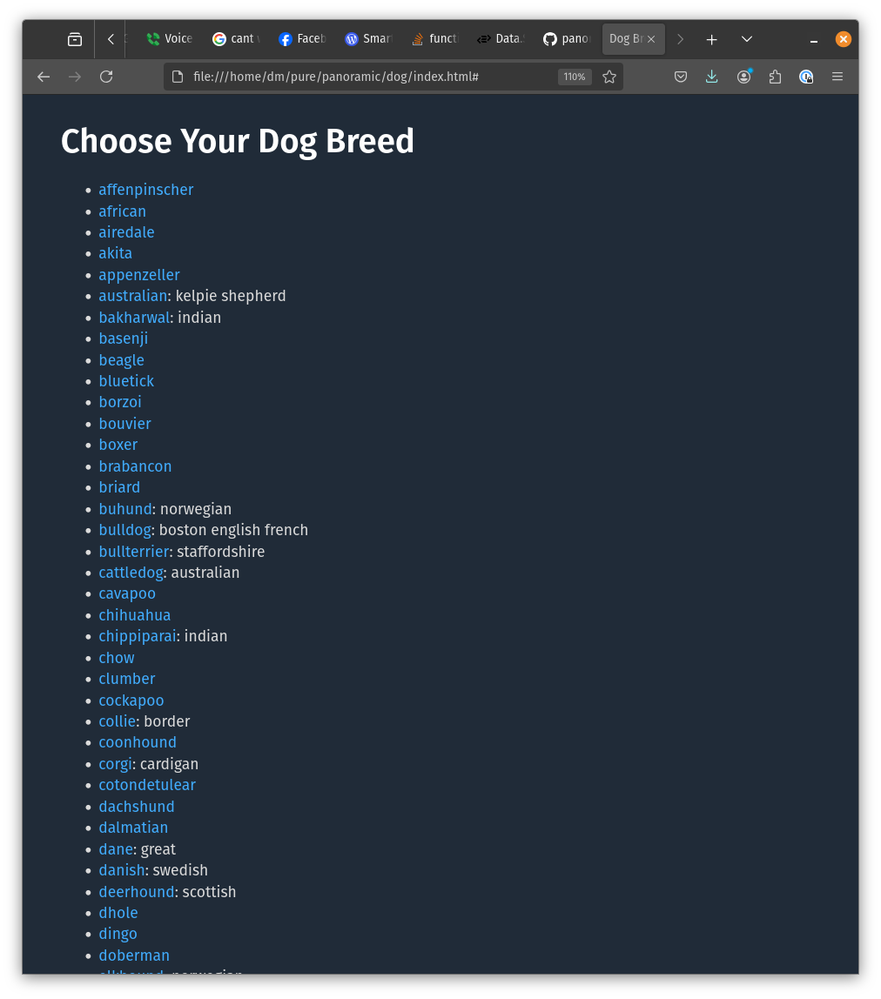
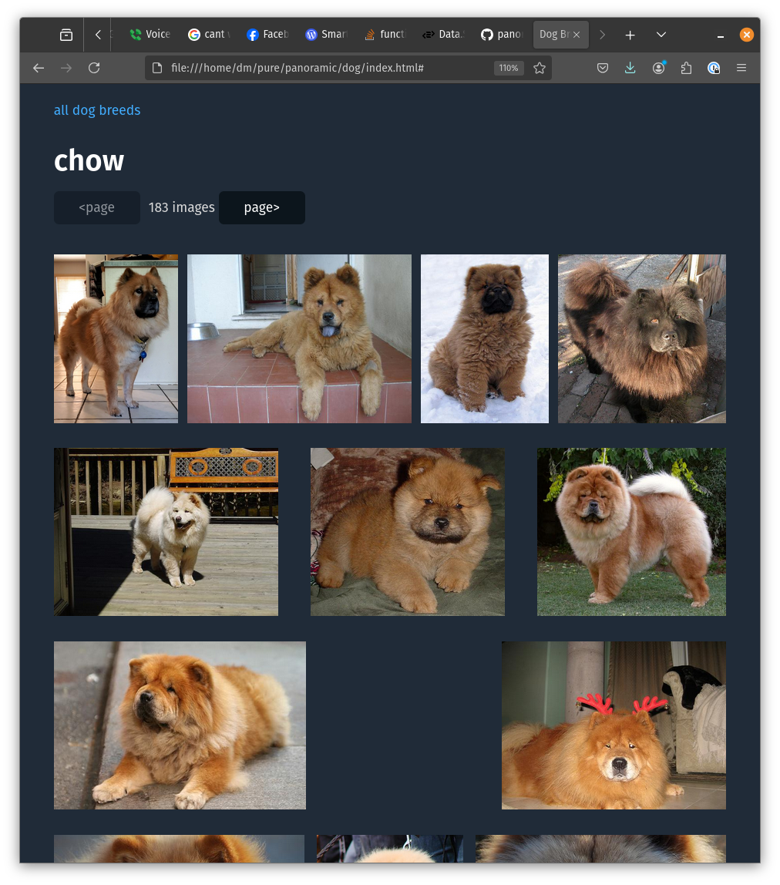

# Dog API SPA

For this project I used Halogen, modifying the sample program provided
in the [Halogen
Guide](https://purescript-halogen.github.io/purescript-halogen/guide/index.html).

Since my background is primarily as a React/TypeScript programmer,
this took me quite some time, and the result has a few known code
smells based on fluency, that I'm pretty sure will shake out with
practice. Smells:

1. It's one big God component, with state all stored in one big disorganized
   pile. For example, the BreedList page can access the BreedDetails
   page's pagination offset.
1. No error handling. 


Getting honest feedback on unknown unknowns was also a secondary
objective of working on this application, so flame away, friends!

## Try it out!
Open index.html in your web browser.




## Development - Dave's notes to Dave
### dev machine build

```
# tested npm 10.2.4, 10.8.3
cd dog
npm ci
npx spago bundle-app
# Imagine 'open' invokes your web browser:
Open index.html
```

### docker build - not tested lately
```
docker build -t dog .
docker run -i dog /bin/bash -c "npx spago bundle-app > /dev/stderr && cat index.js" > index.js
open index.html
```

#### Development
```
docker run -it dog /bin/bash
```
From within this shell you can `spago repl` or what have you.


